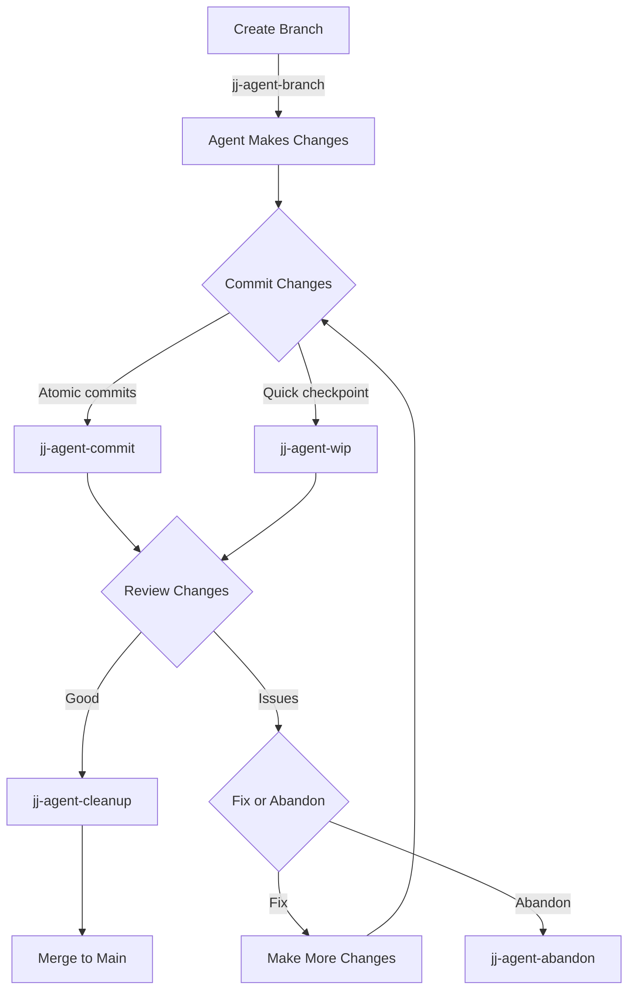
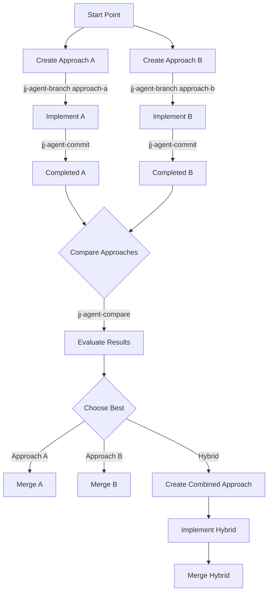
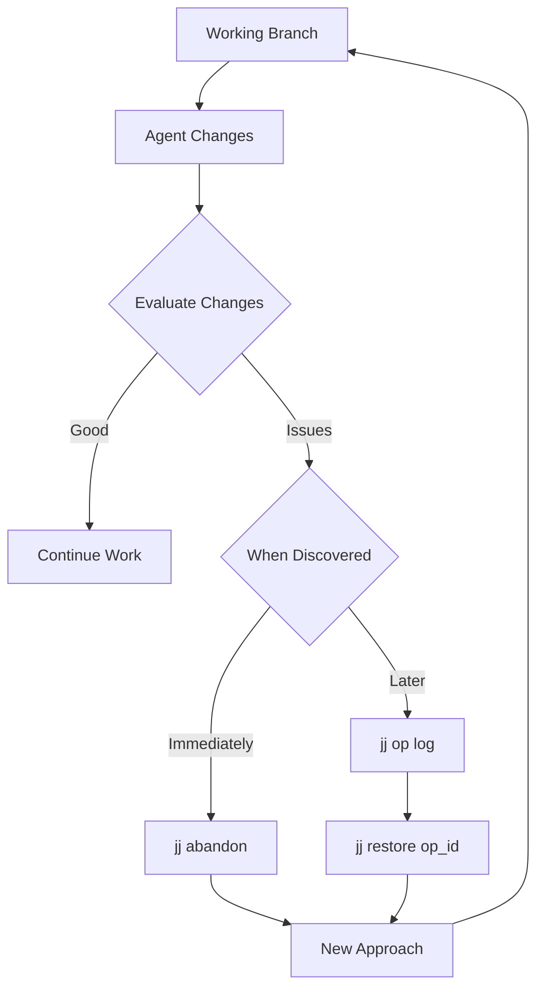

# Jujutsu (jj) Integration for Agent-Assisted Coding

## Table of Contents
- [Workflow Design](#workflow-design)
- [Setup and Configuration](#setup-and-configuration)
- [Core Commands](#core-commands)
- [Agent-Specific Workflows](#agent-specific-workflows)
- [Real-World Examples](#real-world-examples)
- [Troubleshooting](#troubleshooting)
- [Advanced Techniques](#advanced-techniques)
- [Visual Workflow Diagrams](#visual-workflow-diagrams)

## Workflow Design

### Core Principles
1. **Atomic commits**: Each commit represents a single logical change
2. **Frequent checkpoints**: Commit after each significant agent action
3. **Intent-based branching**: Create branches for each new goal
4. **Progressive refinement**: Use squash/reword to clean up history
5. **Conflict isolation**: Manage conflicts in dedicated branches
6. **Exploratory safety**: Use branches for experimental features

### Recommended Workflow

```
1. Create intent branch → 2. Agent makes changes → 3. Commit changes → 
4. Review & revise → 5. Squash/refine → 6. Merge to main
```

## Setup and Configuration

### Shell Function Integration

These functions provide streamlined commands for common agent-related operations:

```bash
jj-agent-branch                # Create a branch for agent work
jj-agent-commit                # Commit with "Agent:" prefix
jj-agent-commit-files          # Commit specific files
jj-agent-commit-interactive    # Commit changes interactively
jj-agent-wip                   # Create a WIP checkpoint
jj-agent-log                   # Show history of agent commits
jj-agent-log-prefix            # Show history of commits with specific prefix
jj-agent-abandon               # Abandon current failed approach
jj-agent-restore               # Restore to a previous state
jj-agent-cleanup               # Squash agent commits
jj-agent-compare               # Compare different approaches
jj-agent-help                  # Show command help
```

## Core Commands


### Agent Workflow Commands

| Phase | JJ Command | Fish Function | Purpose |
|-------|------------|--------------|---------|
| **Setup** | `jj branch create agent-task-x` | `jj-agent-branch agent-task-x` | Create branch for new task |
|  | `jj describe -m "Working on X"` | (included in jj-agent-branch) | Label current operation |
| **Checkpointing** | `jj commit -m "Agent: implemented X"` | `jj-agent-commit "implemented X"` | Create logical checkpoint |
|  | `jj wip` | `jj-agent-wip "optional note"` | Quick checkpoint (work-in-progress) |
| **Navigation** | `jj prev` or `jj next` | (use native commands) | Move through history |
|  | `jj goto branch-name` | (use native commands) | Jump to specific branch |
| **Review** | `jj diff` | (use native commands) | See all current changes |
|  | `jj diff -s` | (use native commands) | See summary of changes |
| **Recovery** | `jj abandon` | `jj-agent-abandon` | Discard failed attempt |
|  | `jj restore <op-id>` | `jj-agent-restore <op-id>` | Return to previous state |
| **Refinement** | `jj squash` | `jj-agent-cleanup [count]` | Combine changes before sharing |
|  | `jj rebase -d main` | (use native commands) | Update branch with latest changes |

### Agent-Specific Command Examples

```bash
# Create atomic commit for a single logical change
jj commit -m "Agent: implemented login form validation"
# Or with fish function:
jj-agent-commit "implemented login form validation"

# Commit specific files for a focused change
jj add file1.js file2.js
jj commit -m "Agent: implemented form validation"
# Or with fish function:
jj-agent-commit-files "implemented form validation" file1.js file2.js

# Commit interactively (selecting changes)
jj add --interactive
jj commit -m "Agent: implemented form validation"
# Or with fish function:
jj-agent-commit-interactive "implemented form validation"

# For a separate logical change, create a separate commit
jj commit -m "Agent: added password strength indicator"
# Or with fish function:
jj-agent-commit "added password strength indicator"

# Quickly save work without proper commit message
jj wip
# Or with fish function:
jj-agent-wip "optional note"

# Split complex change into two commits
jj split

# Abandon a failed approach
jj abandon
# Or with fish function (includes confirmation):
jj-agent-abandon

# Restore previous operation after problems
jj op log
jj restore op_abcdef12345
# Or with fish function:
jj-agent-restore op_abcdef12345

# Clean up history before sharing
jj squash -r @-   # Squash the current commit into its parent
# Or with fish function (includes confirmation):
jj-agent-cleanup 2  # Squash last 2 agent commits
```

## Agent-Specific Workflows

### 1. Exploratory Coding

```bash
# 1. Create an exploration branch
jj bookmark create explore-solution-x
# Or with fish function:
jj-agent-branch explore-solution-x

# 2. Let agent make changes, then checkpoint
jj commit -m "Agent: initial implementation approach"
# Or with fish function:
jj-agent-commit "initial implementation approach"

# 3. Test the approach
# ... run tests or review code ...

# 4. If approach works:
jj squash -r @-2..@   # Squash last 2 commits
jj describe -m "Implemented solution X"
# Or with fish function:
jj-agent-cleanup 2

# 5. If approach fails:
jj abandon
# Or with fish function:
jj-agent-abandon
# ... or ...
jj restore op_previous_good_state
# Or with fish function:
jj-agent-restore op_previous_good_state
```

#### Real-World Exploratory Example: Authentication Implementation

```bash
# 1. Create a branch for implementing JWT authentication
jj-agent-branch explore-jwt-auth

# 2. Let agent implement the JWT generation
jj-agent-commit "added JWT token generation utilities"

# 3. Let agent implement token validation
jj-agent-commit "implemented token validation middleware"

# 4. Test the implementation
npm test -- --grep="Auth"
# Tests show issues with token expiration handling

# 5. Let agent fix the issues
jj-agent-commit "fixed token expiration handling"

# 6. Tests pass, clean up history before integration
jj-agent-cleanup 3
jj describe -m "Implemented JWT authentication system"

# 7. Merge to main
jj goto main
jj merge explore-jwt-auth
```

### 2. Iterative Refinement

```bash
# 1. Start with initial implementation
jj bookmark create feature-x
# ... agent implements feature ...
jj commit -m "Agent: initial implementation of user registration form"

# 2. Iteratively improve with atomic commits
# ... agent adds validation logic ...
jj commit -m "Agent: added email validation to registration form"
# ... agent adds error handling ...
jj commit -m "Agent: implemented form submission error handling"
# ... agent adds accessibility features ...
jj commit -m "Agent: added ARIA attributes for accessibility"

# 3. Review atomic commits individually
jj log
jj diff @~1 @  # Review each commit separately

# 4. Clean up history before merging (optional)
jj squash -i   # Interactive squash
```

#### Real-World Iterative Example: Adding a Dashboard Feature

```bash
# 1. Create branch for the dashboard feature
jj-agent-branch dashboard-feature

# 2. Initial implementation with basic components
jj-agent-commit "implemented dashboard layout and basic components"

# Dashboard code review reveals missing features

# 3. Add data fetching logic in a separate commit
jj-agent-commit "added data fetching and state management"

# 4. Add chart visualization components
jj-agent-commit "implemented chart visualization components"

# 5. Add filtering and sorting capabilities
jj-agent-commit "added filtering and sorting controls"

# 6. Fix performance issues identified during testing
jj-agent-commit "optimized chart rendering performance"

# 7. Review each commit to understand the iterative progress
jj log
jj diff @~5 @~4  # Review the initial layout implementation
jj diff @~4 @~3  # Review data fetching implementation
jj diff @~3 @~2  # Review chart implementation
jj diff @~2 @~1  # Review filtering implementation
jj diff @~1 @    # Review performance optimization

# 8. Now that the feature is complete and reviewed, clean up history for PR
jj-agent-cleanup 5
jj describe -m "Added dashboard feature with charts, filtering, and optimized rendering"
```

### 3. Parallel Approaches

```bash
# 1. Create first approach branch
jj bookmark create approach-a
# Or with fish function:
jj-agent-branch approach-a
# ... agent implements approach A ...
jj commit -m "Agent: completed approach A"
# Or with fish function:
jj-agent-commit "completed approach A"

# 2. Create second approach branch
jj new -m "Exploring alternate approach"
jj bookmark create approach-b
# Or with fish function:
jj-agent-branch approach-b
# ... agent implements approach B ...
jj commit -m "Agent: completed approach B"
# Or with fish function:
jj-agent-commit "completed approach B"

# 3. Compare approaches
jj diff approach-a approach-b
# Or with fish function:
jj-agent-compare approach-a approach-b

# 4. Select preferred approach
jj goto main
jj merge approach-b  # If B is better
```

#### Real-World Parallel Example: Implementing Search Functionality

```bash
# 1. Create branch for server-side search approach
jj-agent-branch search-server-side

# 2. Let agent implement server-side search
jj-agent-commit "implemented server-side search with pagination"
jj-agent-commit "added search filtering options for server API"
jj-agent-commit "implemented caching layer for search results"

# 3. Create branch for client-side search from the same starting point
jj goto main
jj-agent-branch search-client-side

# 4. Let agent implement client-side search
jj-agent-commit "implemented client-side search with indexing"
jj-agent-commit "added fuzzy matching capabilities"
jj-agent-commit "optimized search performance with web workers"

# 5. Compare the two approaches
jj-agent-compare search-server-side search-client-side

# Comparison reveals:
# - Server-side handles large datasets better
# - Client-side has better response time for small-medium datasets
# - Server-side requires more API requests
# - Client-side uses more browser memory

# 6. Choose based on requirements
jj goto main
jj merge search-server-side  # If dealing with large datasets
# OR
jj merge search-client-side  # If optimizing for response time
```

### 4. Recovery from Errors

```bash
# 1. When agent makes a problematic change
jj commit -m "Agent: attempted to fix bug X"

# 2. If you notice issues immediately
jj abandon  # Discard the problematic commit

# 3. If issues are discovered later
jj op log  # Find the last good state
jj restore op_good_state
```

#### Real-World Recovery Example: Fixing a Failed API Integration

```bash
# 1. Start with API integration
jj-agent-branch payment-api-integration

# 2. Agent implements the integration
jj-agent-commit "implemented payment API client"
jj-agent-commit "added payment processing workflow"

# 3. Testing reveals critical bugs in the implementation
# The payment processing has logic errors and security issues

# 4. Option 1: If issues are simple, let agent fix them
jj-agent-commit "fixed payment validation logic"

# 5. Option 2: If implementation is fundamentally flawed, abandon approach
jj-agent-abandon

# 6. Start with a new approach after clarifying requirements
jj-agent-branch payment-api-take2

# 7. Agent implements with better guidance
jj-agent-commit "implemented secure payment API client"
jj-agent-commit "added payment workflow with proper validation"

# 8. Testing confirms this approach works correctly
jj-agent-cleanup 2
jj describe -m "Implemented secure payment processing system"
```

## Troubleshooting

### Common Issues and Solutions

| Issue | Solution | Example |
|-------|----------|---------|
| **Agent changed too many files** | `jj split -i` to interactively separate changes | When the agent modifies 10+ files in a single operation |
| **Conflicting changes** | `jj merge --interactive` to resolve conflicts | When merging agent branches or rebasing onto main |
| **Need to backtrack** | `jj op log` then `jj restore op_id` | When agent introduces a bug or makes unwanted changes |
| **Messy history** | `jj squash -r @-5..@` to combine recent commits | Before sharing or integrating agent work |
| **Lost work** | `jj op log --limit 20` to find recent operations | When you accidentally abandoned a branch |
| **Deprecated commands** | Update to use `jj bookmark` instead of `jj branch` | When seeing warnings about deprecated commands |
| **Function not found** | Source the functions file directly | `source ~/.config/fish/functions/jj-agent.fish` |
| **Commit message errors** | Use quotes around commit messages | `jj-agent-commit "fixed the login bug"` |
| **Accidental WIP commits** | Squash WIP commits before sharing | `jj-agent-cleanup` |
| **Agent makes incorrect changes** | Create a new branch and try again | `jj new` followed by `jj-agent-branch another-attempt` |

### Detailed Troubleshooting Scenarios

#### Recovering from Bad Agent Changes

If the agent makes harmful changes:

```bash
# 1. Identify the last good state
jj log
# Find the commit ID before the bad changes

# 2. Create a recovery branch
jj new -r <good-commit-id>
jj bookmark create recovery-branch

# 3. Continue work from there
# ... make new changes ...
jj-agent-commit "new approach after recovery"
```

#### Fixing Merge Conflicts

When agent changes conflict with main branch:

```bash
# 1. Attempt the merge
jj merge main

# 2. Check status to see conflicts
jj status
# Shows: "Conflicts: file1.js, file2.js"

# 3. Resolve interactively
jj merge --interactive

# 4. Or resolve manually by editing files, then:
jj commit -m "Agent: resolved conflicts with main"
```

#### Dealing with Accidental Branch Deletion

If you accidentally abandon an important branch:

```bash
# 1. Find the abandoned branch in operations log
jj op log --limit 50

# Example output:
# op_123abc: abandoned branch "feature-x"

# 2. Restore the operation before abandonment
jj restore op_123abc~1

# 3. Create a new branch to preserve it
jj bookmark create recovered-feature-x
```

### Conflict Resolution

When the agent creates conflicts:

```bash
# 1. Identify conflicts
jj status
# Example output:
# Conflicts:
#   src/components/LoginForm.js: content conflict
#   src/utils/auth.js: path conflict

# 2. Resolve conflicts
jj merge --interactive
# This will open an interactive interface to resolve each conflict

# 3. Or create separate branch for conflicts
jj new
jj bookmark create conflict-resolution
# ... resolve conflicts manually ...
jj commit -m "Resolved conflicts from agent changes"

# Real-world example:
# Agent adds authentication feature while you refactor the auth module
jj status
# Shows conflicts in auth.js
jj new
jj bookmark create auth-conflict-resolution
# Edit auth.js to combine both changes
jj commit -m "Agent: integrated auth feature with refactored module"
```

## Advanced Techniques

### Custom Templates for Agent Work

Add to your `.jjconfig.toml`:

```toml
[revset-aliases]
# All commits by agent
agent-work = "description(\"Agent: \")"

# Commits needing review
needs-review = "description(\"Agent: \") - description(\"Reviewed: \")"
```

Then use:
```bash
jj log -r "agent-work"  # See all agent commits
jj log -r "needs-review"  # See commits needing review
```

### Tracking Agent Progress

Create a report of agent contributions:

```bash
# Count agent commits
jj log -r "description(\"Agent: \")" | wc -l
# Or with fish function:
jj-agent-log | wc -l

# Find commits with specific prefixes
jj log -r "description(\"[FEAT]:\")"
# Or with fish function:
jj-agent-log-prefix "[FEAT]:"

# Summarize agent work by category
jj log -r "description(\"Agent: \")" | grep -o "Agent: [^\"]*" | sort | uniq -c
# Or with fish function:
jj-agent-log | grep -o "Agent: [^\"]*" | sort | uniq -c
```

### Structured Change Management

Use prefixes for different types of agent work, with each commit representing a single atomic change:

```bash
jj commit -m "Agent: [FEAT] Added user authentication form"
# Or with fish function:
jj-agent-commit "[FEAT] Added user authentication form"

jj commit -m "Agent: [FEAT] Implemented authentication API client"
# Or with fish function:
jj-agent-commit "[FEAT] Implemented authentication API client"

jj commit -m "Agent: [FEAT] Added remember-me functionality"
# Or with fish function:
jj-agent-commit "[FEAT] Added remember-me functionality"

jj commit -m "Agent: [FIX] Corrected validation logic for email field"
# Or with fish function:
jj-agent-commit "[FIX] Corrected validation logic for email field"

jj commit -m "Agent: [REFACTOR] Simplified error handling in auth flow"
# Or with fish function:
jj-agent-commit "[REFACTOR] Simplified error handling in auth flow"

jj commit -m "Agent: [TEST] Added unit tests for authentication API client"
# Or with fish function:
jj-agent-commit "[TEST] Added unit tests for authentication API client"

# Find all commits with specific prefixes
jj log -r "description(\"[FEAT]\")"
# Or with fish function:
jj-agent-log-prefix "[FEAT]:"
```

The key is to keep each commit focused on a specific, cohesive change while using the prefix to indicate the type of change.

### Human-Agent Handoffs

Document the handoff process in commit messages:

```bash
# Agent asking for human input
jj commit -m "Agent: Implemented feature X, need input on approach Y"
# Or with fish function:
jj-agent-commit "Implemented feature X, need input on approach Y"

# Human providing feedback
jj commit -m "Human: Revised approach for Y to use Z pattern"

# Agent continuing based on feedback
jj commit -m "Agent: Refactored using Z pattern as suggested"
# Or with fish function:
jj-agent-commit "Refactored using Z pattern as suggested"

# View the handoff history
jj log
# Or to see only agent commits:
jj-agent-log
```

---

By combining jj's powerful history manipulation with structured agent workflows, you can create a seamless collaborative process that captures incremental progress while maintaining a clean, understandable history.

## Visual Workflow Diagrams

### Basic Agent Workflow



### Parallel Experimentation Workflow



### Recovery Workflow



## Lessons Learned from Real-World Usage

### Repository Cleanup Principles

Based on practical experience with agent-driven repository cleanup, the following lessons have emerged:

#### 1. Conservative History Management

**Problem**: Aggressive commit squashing can create more problems than it solves.

**Solution**: 
- **Preserve atomic commits** that tell a clear development story
- **Focus on real issues**: Empty commits, duplicates, file organization
- **Avoid "prettification"**: Many commits ≠ messy history if they're logical
- **Red flag**: If squashing creates conflicts, reconsider the approach

**Example Decision Matrix**:
```
✅ Safe to clean up:
- Empty/WIP commits with no content
- Duplicate commits from merge conflicts  
- Bookmark consolidation (11 → 4 meaningful ones)
- File organization (proper test/, docs/ structure)

❌ Risky to clean up:
- Atomic commits showing logical progression
- Development history that aids understanding
- Functional commits just because there are "many"
```

#### 2. Tool Consistency Mandate

**Problem**: Building agent workflow tools but not using them defeats their purpose.

**Lesson**: **Always use your own agent functions** instead of raw VCS commands.

**Validation Benefits**:
- Real-world testing reveals usability issues
- Consistency in agent commit patterns
- Protection against interface changes
- Creates authentic usage examples

**Implementation**:
```bash
# Use this approach:
jj-agent-branch cleanup-session
jj-agent-commit "[CLEANUP] organizing files" 
jj-agent-session-start repository-cleanup

# Not this:
jj bookmark create cleanup-session
jj commit -m "Agent: [CLEANUP] organizing files"
```

#### 3. Problem Assessment First

**Problem**: Acting on perceived problems without proper analysis.

**Solution**: **Evidence-based assessment** before any repository changes.

**Assessment Protocol**:
1. **Identify real problems**: What specifically is broken or problematic?
2. **Distinguish perceived problems**: "Messy looking" vs. actual functional issues
3. **Conservative default**: Preserve structure unless clearly problematic
4. **Risk evaluation**: Will the fix create bigger problems?

**Example Assessment**:
```
Real Issues Found:
- 11 bookmarks (too many, some temporary) ✅ Fix
- 6 empty/WIP commits cluttering history ✅ Fix  
- Files in wrong directories ✅ Fix

Non-Issues (preserve):
- 20+ atomic commits (actually good development story) ❌ Don't "fix"
- Multiple feature branches (organized by purpose) ❌ Don't consolidate
```

#### 4. Repository Cleanup Priority Order

**High Priority (immediate action)**:
- Broken functionality or merge conflicts
- Empty commits and development artifacts
- File organization and structure issues

**Medium Priority (with permission)**:
- Bookmark consolidation and naming
- Directory structure improvements
- Documentation organization

**Low Priority (avoid unless requested)**:
- Commit count "optimization"
- History "beautification"
- Aggressive squashing for aesthetics

### Integration with Agent Guidelines

These lessons reinforce the importance of:
- **Task boundary discipline**: Assess before acting
- **Tool usage consistency**: Use agent functions for agent work
- **Conservative implementation**: Preserve working systems
- **Evidence-based decisions**: Real problems vs. assumptions

### Recommended Workflow for Repository Management

```bash
# 1. Assessment Phase
jj-agent-session-start repo-assessment
# Analyze actual problems vs. perceived issues

# 2. Conservative Cleanup Phase  
jj-agent-branch conservative-cleanup
# Focus on real issues: empty commits, file organization

# 3. Validation Phase
# Use agent functions to validate through real usage
jj-agent-test "validation-command"

# 4. Documentation Phase
jj-agent-commit "[DOCS] Document lessons learned from cleanup"
jj-agent-session-end
```

This approach ensures that repository management follows the same disciplined, evidence-based methodology as code development.
